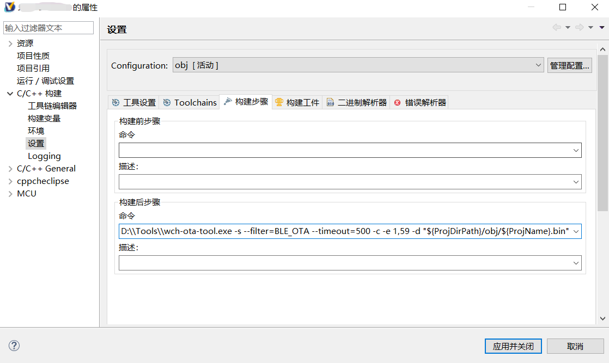

# wch-ota-tool
沁恒(WCH)CH58x/57x系列芯片蓝牙OTA升级命令行工具

## 概述
在使用沁恒的BLE芯片中发现对于蓝牙的OTA功能官方仅提供了Android和iOS的OTA升级APP，不方便在PC端操作，于是使用了沁恒的BLE库[WCHBleLib_MultiOS](https://www.wch.cn/downloads/WCHBleLib_MultiOS_ZIP.html)开发了可在PC上使用的命令行OTA升级工具

*目前仅验证了CH58x/57x系列芯片，需要结合蓝牙OTA例程使用*

## 获取软件
- 下载软件[release](https://github.com/luckyPtr/wch-ota-tool/releases)
- 解压`wch-ota-tool.7z`到本地文件夹
- 使用命令行运行`wch-ota-tool.exe`


## 使用方法

### 1. 使用命令行运行
使用命令行运行`wch-ota-tool.exe`，输入参数-h可获取帮助
```shell
C:\Users>"D:\Tools\wch-ota-tool.exe" -h

Options:
  -?, -h, --help       Displays help on commandline options.
  --help-all           Displays help including Qt specific options.
  -v, --version        Displays version information.
  -s                   Scan nearby BLE devices.
  --filter <Filter>    Filter scanned BLE devices.
  --timeout <Timeout>  Connection timeout.
  -c                   Establish connection to the device.
  -e <Erase>           Erase the specified sectors identified by sectors codes.
                       ex: -e 0,4 to erase sectors 0 to 4.
  -d <FilePath>        Download the content of a file into device memory.
  --addr <Address>     Start address of download.
  --verify             Verify if the programming operation is achieved
                       successfully.
  -r                   Run the code.
```
- -v: 程序版本
- -h: 获取帮助
- -s: 扫描附件的蓝牙设备
- --filter: 蓝牙扫描过滤名称字符串，不写则扫描全部蓝牙(扫描到多个蓝牙时连接强度最强的)
- --timeout: 扫描超时(ms)
- -c: 连接蓝牙
- -e: 擦除flash页，比如"-e 0,4"表示擦除0-4页,不写范围则根据烧录文件的大小进行擦除
- -d: 烧录文件路径
- --addr: 升级程序的起始地址
- --verify: 是否校验
- -r: 运行程序

举例：
`wch-ota-tool.exe -s --filter=BEL_OTA --timeout=500 -c -e 1,59 -d "D:/example/app.bin" --addr=0x1000 --verify -r"`
- 扫描附近蓝牙名包含字符串"BLE_OTA"的蓝牙设备
- 扫描时间时间为500ms
- 连接蓝牙
- 擦除flash 1-59页
- 烧录文件"D:/example/app.bin"，烧录的起始地址为0x1000
- 校验文件
- 运行

### 2.集成到MounRiver中
- 在IDE里打开WCH BLE芯片工程，在*属性*设置里输入命令行参数


其中的烧录文件路径可以使用宏替换做到不同工程间可以通用
```shell
D:\\Tools\\wch-ota-tool.exe -s --filter=BLE_OTA --timeout=500 -c -e 1,59 -d "${ProjDirPath}/obj/${ProjName}.bin" --addr=0x1000 --verify -r`
```

- 每次构建工程后都会执行一次自动烧录